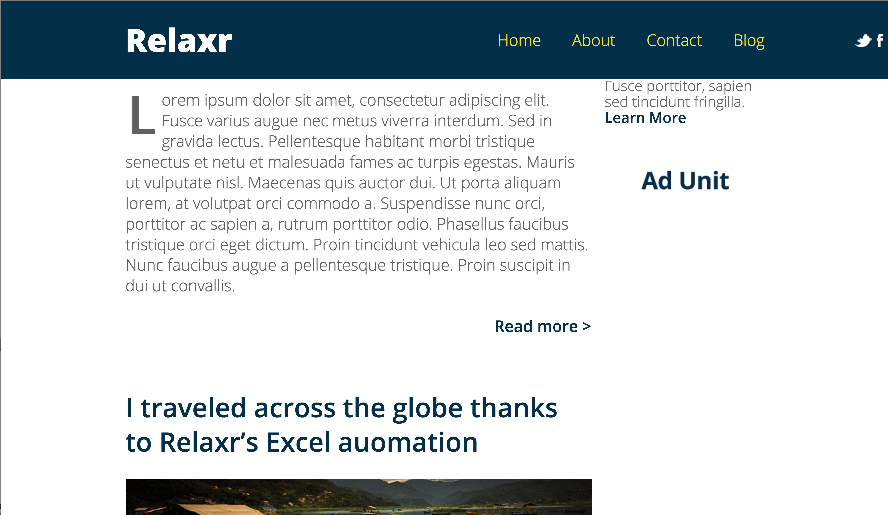

#FEWD Week #9: Bootstrap and Positioning

---


###Description 

In a past assignment, we helped the hot new startup, Relaxr, make their site responsive. Now that we have Bootstrap's grid system in our toolkit, let's implement a responsive Relaxr website using Bootstrap. Additionally, we'll use what we've learned about advanced CSS positioning to fix the top navigation and social links.

<br>

---


###Real-World Applications

- Use the Bootstrap framework to make a responsive layout
- Use advanced positioning techniques to style website

<br>

---


###Technical Requirements 

- Make the Relaxr site responsive at "small" (sm) screen size
- As a user changes the size of a browser window:
  - Content remains in appropriate ```divs```
  - Content remains visible to the user
  - Fonts change size appropriately
  - Margins and padding change size appropriately
  - Content does not overlap
  - The two-column layout changes to a single-column layout when appropriate 
- Use `fixed` positioning to "fix" `<header>` to the top of the browser
- Use `absolute` positioning to social links 10px from the right edge of the header
  - hide social links when they will cover navigation links

####Fixed Header



####Absolutely Positioned Social Links


<br>

---

###Evaluation / Submission

Students should start by using the [starter code](starter_code/) and adding the proper Bootstrap classes and CSS to update the site to look good on mobile devices. You will provide a numeric grade on a scale: does not meet expectations (0); meets expectations (1); exceeds expectations (2).  **Note**: If bullet points have child bullets, grade the child bullets and not the parent bullet belonging to the child. The maximum possible score on this assignment is 20/20. Bonus materials are completely optional.

